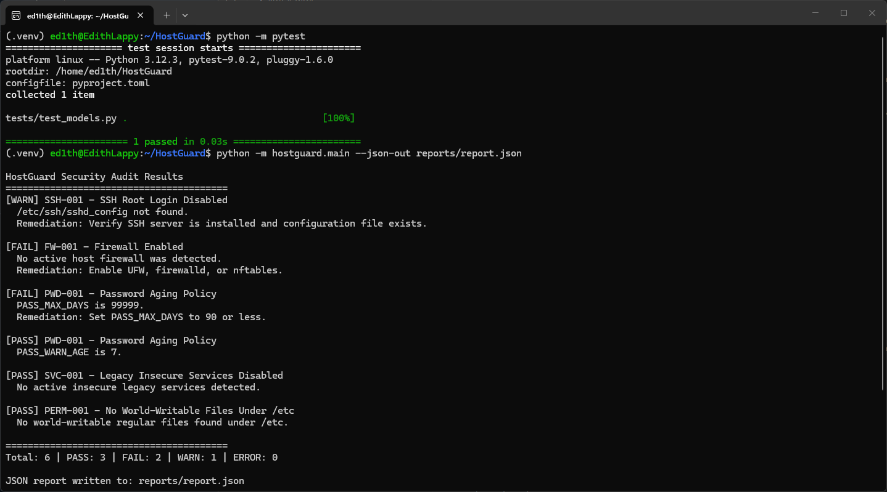

# HostGuard

HostGuard is a student-built Python project for auditing basic Linux security settings and presenting the results in a clear, structured way. It was created as a cybersecurity portfolio piece to show practical work with system hardening, configuration review, and Python automation.

## Portfolio Note

This repository is intentionally lightweight and educational. It is meant to demonstrate how a small auditing tool can be organized, tested, and reported, not to replace a full enterprise security scanner or compliance framework.

## What It Does

HostGuard checks a Linux host for common baseline issues and generates human-readable and machine-readable reports.

It currently checks:

- SSH root login status
- Host firewall availability
- Password aging policy
- Legacy insecure services
- World-writable files under `/etc`

## Features

- Modular check-based architecture
- Console output for quick review
- JSON report generation
- HTML report generation
- Simple dataclass model for results
- Basic automated tests

## Current Checks

| Check ID | Check Name | Description |
|---|---|---|
| SSH-001 | SSH Root Login Disabled | Verifies whether `PermitRootLogin` is disabled |
| FW-001 | Firewall Enabled | Detects whether UFW, firewalld, or nftables is active |
| PWD-001 | Password Aging Policy | Reviews `PASS_MAX_DAYS`, `PASS_MIN_DAYS`, and `PASS_WARN_AGE` |
| SVC-001 | Legacy Insecure Services Disabled | Detects insecure legacy services such as telnet |
| PERM-001 | No World-Writable Files Under `/etc` | Flags risky file permissions under `/etc` |

## Example Output

Sample reports are included so viewers can see what the tool produces without running it locally:

- [sample_report.json](sample_reports/sample_report.json)
- [sample_report.html](sample_reports/sample_report.html)

## Running Locally

The project expects Python 3.11 or newer.

```bash
python -m venv .venv
source .venv/bin/activate
pip install -r requirements.txt
python -m hostguard.main --json-out reports/report.json --html-out reports/report.html
```

## Project Structure

```text
HostGuard/
├── hostguard/
│   ├── main.py
│   ├── models.py
│   ├── checks/
│   └── reporting/
├── reports/
├── sample_reports/
├── screenshots/
├── tests/
├── README.md
├── requirements.txt
└── pyproject.toml
```

## License

HostGuard is released under the MIT License. See [LICENSE](LICENSE) for the full text.

## Screenshot

